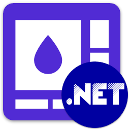

<div id="top"></div>

<!-- PROJECT INFO -->
<br />
<div align="center">
  
  
  
  
  
  
  

</div>

<h1 align="center">My .NET</h1>

[![MIT License][license-shield]][license-url]
[](https://github.com/sandre58/mynet/stargazers)
[](https://github.com/sandre58/mynet/network/members)
[](https://github.com/sandre58/mynet/issues)
[](https://github.com/sandre58/mynet/commits/main)
[](https://github.com/sandre58/mynet/graphs/contributors)
[](https://github.com/sandre58/mynet)

A comprehensive collection of powerful libraries and extensions for modern .NET development (8.0, 9.0, and 10.0). Each package is carefully designed to be independent, modular, and production-ready, enabling developers to pick exactly what they need to enhance their applications.

**✨ Features:**
- 🏷️ **Automatic semantic versioning** based on conventional commits
- 🔄 **Independent package versioning** for each library  
- 📦 **Ready-to-use NuGet packages** with semantic versions
- 🧪 **Comprehensive testing** with code coverage
- 📊 **Continuous integration** with automated builds and releases

## Packages

[![Build][build-shield]][build-url]
[](https://codecov.io/gh/sandre58/mynet)
[](https://sandre58.github.io/MyNet/)
[](https://semver.org/)
[](https://conventionalcommits.org/)
[](#)
[](#)
[](#)
[](#)

| Package | Description | NuGet |
|---|---|---|
| [**MyNet.Utilities**](src/MyNet.Utilities) | 🔧 Core utilities for .NET development: authentication, cache, encryption, geography, generator, Google services, IO operations, localization, logging, mail, messaging, progress tracking, and threading utilities. | [](https://www.nuget.org/packages/MyNet.Utilities) |
| [**MyNet.UI**](src/MyNet.UI) | 🎨 UI helpers for notifications, dialogs, navigation, themes, and user interface components. | [](https://www.nuget.org/packages/MyNet.UI) |
| [**MyNet.Observable**](src/MyNet.Observable) | 🔄 Editable and validatable object base classes with property change notifications and validation support. | [](https://www.nuget.org/packages/MyNet.Observable) |
| [**MyNet.Humanizer**](src/MyNet.Humanizer) | 👤 Convert objects and values to human-readable strings with natural language formatting. | [](https://www.nuget.org/packages/MyNet.Humanizer) |
| [**MyNet.CsvHelper.Extensions**](src/MyNet.CsvHelper.Extensions) | 📊 Extensions for CsvHelper to simplify CSV mapping, import, and export operations. | [](https://www.nuget.org/packages/MyNet.CsvHelper.Extensions) |
| [**MyNet.AutoMapper.Extensions**](src/MyNet.AutoMapper.Extensions) | 🗺️ Extensions and helpers for seamless AutoMapper integration and configuration. | [](https://www.nuget.org/packages/MyNet.AutoMapper.Extensions) |
| [**MyNet.Http**](src/MyNet.Http) | 🌐 HTTP client helpers and extensions for simplified web API communication. | [](https://www.nuget.org/packages/MyNet.Http) |
| [**MyNet.Utilities.Generator.Extensions**](src/MyNet.Utilities.Generator.Extensions) | 🎲 Generate realistic random data for testing, demos, and simulations. | [](https://www.nuget.org/packages/MyNet.Utilities.Generator.Extensions) |
| [**MyNet.Utilities.Geography.Extensions**](src/MyNet.Utilities.Geography.Extensions) | 🌍 Access detailed geography information including countries, cities, and regions. | [](https://www.nuget.org/packages/MyNet.Utilities.Geography.Extensions) |
| [**MyNet.Utilities.Localization.Extensions**](src/MyNet.Utilities.Localization.Extensions) | 🌐 Localization resources and helpers for multi-language applications. | [](https://www.nuget.org/packages/MyNet.Utilities.Localization.Extensions) |
| [**MyNet.Utilities.Logging.NLog**](src/MyNet.Utilities.Logging.NLog) | 📝 Logging integration with NLog for structured logging. | [](https://www.nuget.org/packages/MyNet.Utilities.Logging.NLog) |
| [**MyNet.Utilities.Mail.MailKit**](src/MyNet.Utilities.Mail.MailKit) | 📧 Email sending capabilities with MailKit integration. | [](https://www.nuget.org/packages/MyNet.Utilities.Mail.MailKit) |

## 🚀 Getting Started

### Prerequisites

- **.NET 8.0, 9.0, or 10.0** - The libraries support the latest .NET versions
- **Visual Studio 2022** or **Visual Studio Code** (recommended)
- **NuGet** package manager

### Installation

Install any package via NuGet Package Manager, .NET CLI, or PackageReference:

**Using .NET CLI:**
```bash
# Core utilities package
dotnet add package MyNet.Utilities

# UI helpers package  
dotnet add package MyNet.UI

# Observable objects package
dotnet add package MyNet.Observable

# Humanization package
dotnet add package MyNet.Humanizer

# CSV operations package
dotnet add package MyNet.CsvHelper.Extensions

# AutoMapper extensions package
dotnet add package MyNet.AutoMapper.Extensions

# HTTP utilities package
dotnet add package MyNet.Http
```

**Using Package Manager Console:**
```powershell
Install-Package MyNet.Utilities
Install-Package MyNet.UI
# ... and so on
```

**Using PackageReference:**
```xml
<PackageReference Include="MyNet.Utilities" Version="1.0.*" />
<PackageReference Include="MyNet.UI" Version="1.0.*" />
```

### Quick Start

After installing a package, explore the package-specific documentation in the `src/` directory of each project for detailed usage examples and API references.

## 🏷️ Versioning System

This repository uses **automatic semantic versioning** powered by conventional commits:

### 📋 Version Format
- **Main branch**: `X.Y.Z-pre.BUILD` (e.g., `1.5.0-pre.124`)
- **Feature branches**: `X.Y.Z-beta.BUILD` (e.g., `1.5.0-beta.89`)
- **Released packages**: `X.Y.Z` (e.g., `1.5.0`)

### 🔄 Version Calculation
Versions are automatically calculated based on conventional commit messages:

```bash
# Patch version increment (1.0.0 → 1.0.1)
git commit -m "fix(utils): resolve null reference exception"

# Minor version increment (1.0.0 → 1.1.0)  
git commit -m "feat(ui): add new dialog component"

# Major version increment (1.0.0 → 2.0.0)
git commit -m "feat(api)!: redesign authentication API

BREAKING CHANGE: Authentication interface signature changed"
```

### 🎯 Per-Project Versioning
Each package is versioned independently based on its specific changes:
- **MyNet.Utilities**: `2.3.1-pre.156`
- **MyNet.UI**: `1.8.0-pre.156` 
- **MyNet.Observable**: `1.2.4-pre.156`

### 📊 CI/CD Integration
- ✅ **Automatic builds** with computed semantic versions
- ✅ **NuGet packages** generated with proper version numbers
- ✅ **Coverage reports** deployed to [GitHub Pages](https://sandre58.github.io/MyNet/)
- ✅ **Quality gates** with automated testing

## 📁 Repository Structure

- **`src/`** — Source code for all packages organized by category:
  - **`MyNet.Utilities*`** — Core utilities and extensions
  - **`MyNet.UI`** — Cross-platform UI helpers
  - **`MyNet.Observable`** — Observable object patterns and validation
  - **`MyNet.Humanizer`** — Human-readable string conversion
  - **`MyNet.CsvHelper.Extensions`** — CSV import/export utilities
  - **`MyNet.AutoMapper.Extensions`** — Object mapping helpers
  - **`MyNet.Http`** — HTTP client utilities
  
- **`tests/`** — Comprehensive unit and integration tests
- **`assets/`** — Project logos, icons, and visual assets
- **`build/`** — MSBuild configuration and shared properties
- **`scripts/`** — Build automation and utility scripts
  - **`compute-version.js`** — Semantic version calculation based on conventional commits
- **`.github/`** — CI/CD workflows and GitHub automation
  - **`workflows/ci.yml`** — Integrated CI/CD with automatic versioning
- **`docs/`** — Documentation and workflow guides
  - **`WORKFLOWS.md`** — Complete CI/CD documentation

## 🛠️ Development

### Building from Source

```bash
# Clone the repository
git clone https://github.com/sandre58/MyNet.git
cd MyNet

# Install Node.js dependencies (for versioning)
npm install

# Build all projects (with automatic versioning)
dotnet build

# Run tests with coverage
dotnet test --collect:"XPlat Code Coverage"

# Create packages with semantic versions
dotnet pack
```

### 🔧 Development Workflow

**Using conventional commits for automatic versioning:**

```bash
# Create a feature branch
git checkout -b feature/add-caching-support

# Make changes with conventional commit messages
git commit -m "feat(utils): add memory caching with TTL support"
git commit -m "test(utils): add comprehensive caching tests"
git commit -m "docs(utils): add caching documentation"

# Push and create pull request
git push origin feature/add-caching-support
```

**Automatic CI process:**
1. 🏷️ **Version calculation**: Each project gets semantic version based on commits
2. ✅ **Build & test**: All projects built with computed versions  
3. 📦 **Package creation**: NuGet packages with semantic versions
4. 📊 **Coverage reports**: Generated and deployed to GitHub Pages
5. 🔄 **Artifacts**: Ready-to-ship packages available for download

### Contributing

We welcome contributions! Please see our [Contributing Guidelines](CONTRIBUTING.md) and [Code of Conduct](CODE_OF_CONDUCT.md) for details on how to get involved.

**📝 Contribution Requirements:**
- Use **conventional commit messages** for automatic versioning
- Follow **semantic versioning** principles  
- Ensure **test coverage** for new features
- Update documentation as needed

**🔍 Useful Resources:**
- 🏷️ **[Conventional Commits](https://conventionalcommits.org/)** - Commit message format
- 📊 **[Coverage Report](https://sandre58.github.io/MyNet/)** - Live test coverage
- 🔧 **[Semantic Versioning](https://semver.org/)** - Versioning specification

## 📄 License

Copyright © 2016-2025 Stéphane ANDRE.

Distributed under the MIT License. See [LICENSE](./LICENSE) for complete details.

<!-- MARKDOWN LINKS & IMAGES -->
[license-shield]: https://img.shields.io/github/license/sandre58/MyNet?style=for-the-badge
[license-url]: https://github.com/sandre58/MyNet/blob/main/LICENSE
[build-shield]: https://img.shields.io/github/actions/workflow/status/sandre58/MyNet/ci.yml?logo=github&label=CI
[build-url]: https://github.com/sandre58/MyNet/actions