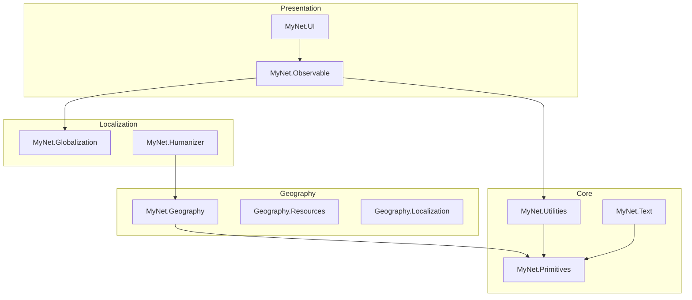

<div align="center">

# MyNet

**Modular .NET 10 libraries for MVVM desktop applications** — observable models, UI shell, globalization, geography, mail, HTTP, and shared primitives.

[](https://github.com/sandre58/MyNet/blob/main/LICENSE)
[](https://github.com/sandre58/MyNet/issues)
[](https://github.com/sandre58/MyNet/graphs/contributors)
[](https://github.com/sandre58/MyNet/commits/main/)
[](https://github.com/sandre58/MyNet)

[](https://dotnet.microsoft.com/download/dotnet/10.0)
[](https://github.com/sandre58/MyNet/search?l=c%23)
[](https://www.nuget.org/packages?q=MyNet)


[](https://github.com/sandre58/MyNet/actions/workflows/ci.yml)
[](https://codecov.io/gh/sandre58/MyNet)
[](https://codecov.io/gh/sandre58/MyNet/tree/main)


[](https://semver.org/)
[](https://www.conventionalcommits.org/)


[](https://github.com/sandre58/MyNet/stargazers)
[](https://github.com/sandre58/MyNet/network/members)

[Documentation](docs/index.md) · [Getting started](docs/getting-started.md) · [Guides](docs/guides/README.md) · [Releases](https://github.com/sandre58/MyNet/releases) · [Report a bug](https://github.com/sandre58/MyNet/issues)

</div>

---

## 📋 Overview

**MyNet** (My .NET) is a suite of **22 focused NuGet packages** maintained as a single monorepo. Each library targets a specific concern so you can reference only what you need — from low-level primitives to a UI-agnostic MVVM presentation layer.

| Highlight | Description |
| :-------- | :---------- |
| **Modular** | Small packages with clear boundaries; prefer the smallest API surface that fits your scenario. |
| **MVVM-first** | Observable models, validation, metadata generation, messaging, and a framework-independent UI layer (WPF, Avalonia, MAUI, …). |
| **Localization-ready** | Globalization, human-readable formatters, geography, and satellite resource packages. |
| **Production-oriented** | XML docs, analyzers, SourceLink, symbol packages, and CI with coverage gates. |

---

## 🚀 Quick start

**Desktop MVVM app** — typical packages:

```bash
dotnet add package MyNet.Observable
dotnet add package MyNet.UI
dotnet add package MyNet.Globalization
dotnet add package MyNet.IO
```

```csharp
using Microsoft.Extensions.DependencyInjection;
using MyNet.Globalization.Extensions;
using MyNet.UI.Dialogs;
using MyNet.UI.Locators;
using MyNet.UI.Navigation;
using MyNet.UI.Notifications;
using MyNet.UI.Toasting;
using MyNet.UI.ViewModels;

var services = new ServiceCollection();
services.AddGlobalization();
services.AddViewLocators();
services.AddDialogs(b => b.AddPresenter<MyDialogPresenter>()); // your IDialogPresenter
services.AddNavigation();
services.AddNotifications();
services.AddToasting();
services.AddShell();
```

More scenarios (geography, mail, fakers, HTTP): **[Getting started](docs/getting-started.md)**.

---

## 📦 Package catalog

Each package ships with its own README (also embedded in the NuGet gallery). Icons live under [`assets/`](assets/README.md).

### 🧱 Foundations

| Icon | Package | Description | Docs |
| :-: | :--- | :--- | :--- |
|  | [**MyNet.Primitives**](src/MyNet.Primitives/README.md) | SmartEnum, intervals, conversions, comparers, sequences — minimal BCL-only foundation. | [Guide](docs/guides/foundations.md) · [NuGet](https://www.nuget.org/packages/MyNet.Primitives) |
|  | [**MyNet.Text**](src/MyNet.Text/README.md) | Templating, slugify, sanitize, normalize, truncate, redaction, and text pipelines. | [Guide](docs/guides/foundations.md) · [NuGet](https://www.nuget.org/packages/MyNet.Text) |
|  | [**MyNet.Utilities**](src/MyNet.Utilities/README.md) | Caching, encryption, progress, threading, deferral, and DI-friendly cross-cutting helpers. | [Guide](docs/guides/foundations.md) · [NuGet](https://www.nuget.org/packages/MyNet.Utilities) |
|  | [**MyNet.Generator**](src/MyNet.Generator/README.md) | Pseudo-random generators, weighted sampling, and sequence helpers for tests and prototyping. | [Guide](docs/guides/foundations.md) · [NuGet](https://www.nuget.org/packages/MyNet.Generator) |
|  | [**MyNet.Reflection**](src/MyNet.Reflection/README.md) | Cached reflection accessors and expression helpers to reduce runtime overhead. | [Guide](docs/guides/foundations.md) · [NuGet](https://www.nuget.org/packages/MyNet.Reflection) |
|  | [**MyNet.Metadata**](src/MyNet.Metadata/README.md) | Type/member metadata registry with pluggable feature providers. | [Guide](docs/guides/observable.md#metadata-generation) · [NuGet](https://www.nuget.org/packages/MyNet.Metadata) |
|  | [**MyNet.Temporal**](src/MyNet.Temporal/README.md) | TimeSpan decomposition and duration helpers for readable time representations. | [Guide](docs/guides/foundations.md) · [NuGet](https://www.nuget.org/packages/MyNet.Temporal) |

### 💬 Data and messaging

| Icon | Package | Description | Docs |
| :-: | :--- | :--- | :--- |
|  | [**MyNet.Collections**](src/MyNet.Collections/README.md) | Observable collections, batch synchronizers, and range notifications for MVVM. | [Guide](docs/guides/collections-messaging.md) · [NuGet](https://www.nuget.org/packages/MyNet.Collections) |
|  | [**MyNet.Messaging**](src/MyNet.Messaging/README.md) | Weak-reference in-process messenger for loosely coupled view models and services. | [Guide](docs/guides/collections-messaging.md) · [NuGet](https://www.nuget.org/packages/MyNet.Messaging) |

### 🖥️ MVVM and UI

| Icon | Package | Description | Docs |
| :-: | :--- | :--- | :--- |
|  | [**MyNet.Observable**](src/MyNet.Observable/README.md) | Observable models, edition tracking, FluentValidation, metadata, and a Roslyn source generator. | [Guide](docs/guides/observable.md) · [NuGet](https://www.nuget.org/packages/MyNet.Observable) |
|  | [**MyNet.UI**](src/MyNet.UI/README.md) | UI-agnostic shell, dialogs, navigation, notifications, toasts, and workspace patterns. | [UI](docs/guides/ui.md) · [Navigation](docs/guides/navigation.md) · [Dialogs](docs/guides/dialogs.md) · [NuGet](https://www.nuget.org/packages/MyNet.UI) |

> **Note:** `MyNet.Observable.Metadata.Generator` is a Roslyn analyzer shipped inside **MyNet.Observable** (not a separate NuGet package).

### 🌍 Localization and geography

| Icon | Package | Description | Docs |
| :-: | :--- | :--- | :--- |
|  | [**MyNet.Globalization**](src/MyNet.Globalization/README.md) | Culture-aware formatting, translatable resources, and localization services for DI hosts. | [Guide](docs/guides/globalization.md) · [NuGet](https://www.nuget.org/packages/MyNet.Globalization) |
|  | [**MyNet.Humanizer**](src/MyNet.Humanizer/README.md) | Localized human-readable strings for dates, enums, lists, geography, and common types. | [Guide](docs/guides/humanizer.md) · [NuGet](https://www.nuget.org/packages/MyNet.Humanizer) |
|  | [**MyNet.Geography**](src/MyNet.Geography/README.md) | ISO 3166 countries, addresses, coordinates, and a pluggable flag provider contract. | [Guide](docs/guides/geography.md) · [NuGet](https://www.nuget.org/packages/MyNet.Geography) |
|  | [**MyNet.Geography.Resources**](src/MyNet.Geography.Resources/README.md) | Embedded country flag PNG assets and default `IFlagProvider` implementation. | [Guide](docs/guides/geography.md) · [NuGet](https://www.nuget.org/packages/MyNet.Geography.Resources) |
|  | [**MyNet.Geography.Localization**](src/MyNet.Geography.Localization/README.md) | Localized country display names and Humanizer formatters for geography types. | [Guide](docs/guides/geography.md) · [NuGet](https://www.nuget.org/packages/MyNet.Geography.Localization) |
|  | [**MyNet.Google**](src/MyNet.Google/README.md) | Google Maps geocoding, directions, distance matrix, and map URL builders. | [Guide](docs/guides/geography.md) · [NuGet](https://www.nuget.org/packages/MyNet.Google) |

### 🔌 Infrastructure

| Icon | Package | Description | Docs |
| :-: | :--- | :--- | :--- |
|  | [**MyNet.IO**](src/MyNet.IO/README.md) | File/path helpers, auto-save coordinators, and portable registry abstractions. | [Guide](docs/guides/io-platform.md) · [NuGet](https://www.nuget.org/packages/MyNet.IO) |
|  | [**MyNet.Platform.Windows**](src/MyNet.Platform.Windows/README.md) | Windows registry, authentication, and MAPI mail adapters. | [Guide](docs/guides/io-platform.md) · [NuGet](https://www.nuget.org/packages/MyNet.Platform.Windows) |
|  | [**MyNet.Http**](src/MyNet.Http/README.md) | HTTP client helpers and typed Web API consumption on `HttpClient` + System.Text.Json. | [Guide](docs/guides/http.md) · [NuGet](https://www.nuget.org/packages/MyNet.Http) |
|  | [**MyNet.Mail**](src/MyNet.Mail/README.md) | Email models, attachments, address parsing, and transport-independent `IMailService`. | [Guide](docs/guides/mail.md) · [NuGet](https://www.nuget.org/packages/MyNet.Mail) |
|  | [**MyNet.Mail.MailKit**](src/MyNet.Mail.MailKit/README.md) | MailKit SMTP implementation with TLS, connection reuse, and DI registration. | [Guide](docs/guides/mail.md) · [NuGet](https://www.nuget.org/packages/MyNet.Mail.MailKit) |
|  | [**MyNet.Fakers**](src/MyNet.Fakers/README.md) | Locale-aware fake data for names, addresses, emails, and test fixtures. | [Guide](docs/guides/fakers.md) · [NuGet](https://www.nuget.org/packages/MyNet.Fakers) |

Browse all packages on NuGet: [search `MyNet`](https://www.nuget.org/packages?q=MyNet).

---

## 🏗️ Architecture

Prefer the **smallest package** that exposes the API you need. Higher layers pull transitive MyNet dependencies automatically.


```mermaid
flowchart TB
  subgraph ui [Presentation]
    UI[MyNet.UI]
    OBS[MyNet.Observable]
  end
  subgraph loc [Localization]
    GLOB[MyNet.Globalization]
    HUM[MyNet.Humanizer]
  end
  subgraph geo [Geography]
    GEO[MyNet.Geography]
    GEO_R[Geography.Resources]
    GEO_L[Geography.Localization]
  end
  subgraph core [Core]
    PRIM[MyNet.Primitives]
    TEXT[MyNet.Text]
    UTIL[MyNet.Utilities]
  end
  UI --> OBS
  OBS --> UTIL
  OBS --> GLOB
  HUM --> GEO
  GEO --> PRIM
  UTIL --> PRIM
  TEXT --> PRIM
```

Full dependency notes: **[Getting started — layering](docs/getting-started.md#dependency-layering)**.

---

## 📚 Documentation

| Audience | Start here |
| :--- | :--- |
| New consumer | [Getting started](docs/getting-started.md) → [Guides index](docs/guides/README.md) |
| One NuGet package | [Package catalog](#package-catalog) → `src/<Package>/README.md` |
| Desktop MVVM app | [Observable guide](docs/guides/observable.md) + [UI guide](docs/guides/ui.md) |
| Contributor | [CONTRIBUTING.md](CONTRIBUTING.md) · [Documentation index](docs/index.md) · [Backlog](docs/TODO.md) |

**System guides** (14 topics): [Observable](docs/guides/observable.md) · [UI](docs/guides/ui.md) · [Dialogs](docs/guides/dialogs.md) · [Notifications & toasts](docs/guides/notifications-and-toasts.md) · [Shell](docs/guides/shell.md) · [Theming](docs/guides/theming.md) · [Globalization](docs/guides/globalization.md) · [Humanizer](docs/guides/humanizer.md) · [Geography](docs/guides/geography.md) · [HTTP](docs/guides/http.md) · [Mail](docs/guides/mail.md) · [IO & platform](docs/guides/io-platform.md) · [Fakers](docs/guides/fakers.md) · [Foundations](docs/guides/foundations.md) · [Collections & messaging](docs/guides/collections-messaging.md)

---

## 📁 Repository layout

```
src/           Packable libraries (each with README.md for NuGet)
tests/         Unit tests (*.Tests — not packed)
docs/          Guides and reference documentation (English)
assets/        NuGet package icons (128×128 PNG)
build/         MSBuild props (package, coverage, analyzers)
packages/      Local NuGet output (dotnet pack)
```

---

## 🔧 Build, test, and pack

**Prerequisites:** [.NET 10 SDK](https://dotnet.microsoft.com/download/dotnet/10.0)

```bash
# Build the full solution
dotnet build MyNet.slnx

# Run tests
dotnet test MyNet.slnx -c Release

# Pack all NuGet packages
dotnet pack MyNet.slnx -c Release
```

Packages are written to `packages/` (see [`build/package.props`](build/package.props)). CI runs on every push to `main` and on pull requests — see [`.github/workflows/ci.yml`](.github/workflows/ci.yml).

Contributing: **[CONTRIBUTING.md](CONTRIBUTING.md)**.

---

## ⚖️ License

MIT — see [LICENSE](LICENSE).

<div align="center">

<sub>

Copyright © 2016–2026 Stéphane ANDRE. All rights reserved.

</sub>

</div>
