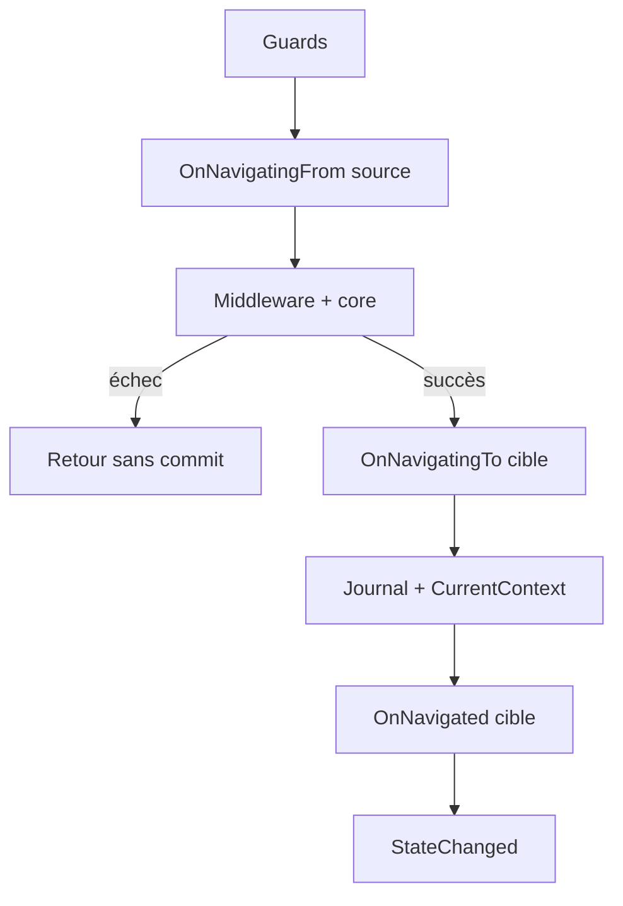

# Navigation (MyNet.UI)

Pile de navigation applicative **indépendante de l’UI** (WPF, Avalonia, etc.) : journal back/forward, guards, middleware, lifecycle et paramètres typés.

Code : [`src/MyNet.UI/Navigation`](../src/MyNet.UI/Navigation).

## Enregistrement DI

```csharp
services
    .AddNavigation()
    .AddNavigationGuard<UnsavedChangesGuard>()
    .AddNavigationMiddleware<LoggingNavigationMiddleware>();

services.AddTransient<SettingsPage>();
services.AddTransient<DashboardPage>();
```

| Extension | Rôle |
|-----------|------|
| `AddNavigation()` | Journal, lifecycle, `INavigationService`, `INavigationClient` |
| `AddNavigationGuard<T>()` | Règle d’autorisation (ordre = ordre d’enregistrement) |
| `AddNavigationMiddleware<T>()` | Couche autour du core (premier enregistré = plus externe) |

Les pages (`INavigationPage`) sont résolues via `ActivatorUtilities` dans `INavigationClient` : les enregistrer en **Transient** (ou Scoped) selon le cycle de vie voulu.

## Composants

| Service | Rôle |
|---------|------|
| `INavigationClient` | API fluent : `To<TPage>().With(...).GoAsync()` |
| `INavigationService` | Navigation bas niveau, journal, `StateChanged` |
| `INavigationJournal` | Piles back / forward |
| `INavigationLifecycle` | Délègue les hooks aux pages source / cible |
| `INavigationGuard` | Bloque la navigation (`false` → `Cancelled`) |
| `INavigationMiddleware` | Pipeline autour du core (UI, logging, etc.) |

## Pipeline (ordre d’exécution)



- **Guards** : premier `false` annule ; le journal n’est pas modifié.
- **OnNavigatingTo** : uniquement après un middleware/core réussi (la cible n’est pas préparée en cas d’échec).
- **OnNavigatingFrom** : peut s’exécuter avant un échec middleware ; pas de rollback automatique côté source pour l’instant.
- **Core** (`ExecuteCoreAsync`) : stub dans la bibliothèque ; le host UI (middleware dédié) affichera la vue plus tard.

## API fluent

```csharp
public class ShellViewModel(INavigationClient navigation)
{
    public Task OpenSettingsAsync() =>
        navigation
            .To<SettingsPage>()
            .With(new { Tab = "General" })
            .GoAsync();

    public Task OpenPlayerAsync(int id) =>
        navigation
            .To<PlayerPage>()
            .WithParameter(nameof(id), id)
            .GoAsync();
}
```

Raccourci : `navigation.NavigateToAsync<PlayerPage>(new { id })`.

## Lifecycle sur une page

```csharp
public sealed class SettingsPage : INavigationPage
{
    public Task OnNavigatingToAsync(NavigationContext context, CancellationToken cancellationToken)
    {
        var tab = context.Parameters?.Get<string>("Tab") ?? "General";
        return Task.CompletedTask;
    }

    public Task OnNavigatedAsync(NavigationContext context, CancellationToken cancellationToken)
        => Task.CompletedTask;

    public Task OnNavigatingFromAsync(NavigationContext context, CancellationToken cancellationToken)
        => Task.CompletedTask;
}
```

## Paramètres

`NavigationParameters` accepte objets anonymes, dictionnaires, records, etc. :

```csharp
parameters.Get<int>("PlayerId");
parameters.TryGetValue("Count", out long count);
```

Conversion optionnelle via `IConvertible`, enums et types nullable (`long` → `int`, etc.).

## Réagir aux changements d’état (sans dépendre de WPF)

```csharp
navigation.StateChanged += (_, e) =>
{
    // e.CurrentContext, e.CanGoBack, e.CanGoForward
};
```

Utile pour activer `CanExecute` sur Back/Forward dans un ViewModel.

## Guard exemple

```csharp
public sealed class UnsavedChangesGuard : INavigationGuard
{
    public Task<bool> CanNavigateAsync(
        NavigationContext? from,
        NavigationContext to,
        CancellationToken cancellationToken)
    {
        if (from?.To is IHasUnsavedChanges page && page.IsDirty)
            return ConfirmDiscardAsync(cancellationToken);

        return Task.FromResult(true);
    }
}
```

## Middleware UI (futur client WPF / Avalonia)

Le core ne touche pas aux contrôles. Un middleware côté application peut :

1. Résoudre la vue via `IViewFactory` (voir [Locators](LOCATORS_GUIDE.md)).
2. Assigner `Content` / `CurrentView` du shell.
3. Appeler `next()` pour laisser le pipeline terminer.

```csharp
public sealed class ViewHostMiddleware(IViewHost host) : INavigationMiddleware
{
    public async Task<NavigationResult> InvokeAsync(
        NavigationContext? from,
        NavigationContext to,
        Func<Task<NavigationResult>> next,
        CancellationToken cancellationToken)
    {
        // host.Show(to.To) — à implémenter dans le projet client
        return await next().ConfigureAwait(false);
    }
}
```

## Back / forward

- `GoBackAsync` / `GoForwardAsync` : réutilisent les **instances** de pages stockées dans le journal.
- `NavigateToAsync` vers une nouvelle page : nouvelle instance DI à chaque `To<T>()`.
- `ResetAsync()` : vide le journal et lève `StateChanged` (sous le même verrou que les navigations).

## Fichiers

| Dossier / fichier | Contenu |
|-------------------|---------|
| `NavigationService.cs` | Orchestration, verrou, pipeline |
| `NavigationClient.cs` | Façade + résolution DI |
| `Models/` | `NavigationContext`, `NavigationParameters`, statuts |
| `ServiceCollectionExtensions.cs` | Enregistrement DI |

## Voir aussi

- [UI Architecture](UI_ARCHITECTURE.md)
- [Locators](LOCATORS_GUIDE.md) — association ViewModel / View pour le futur host UI
