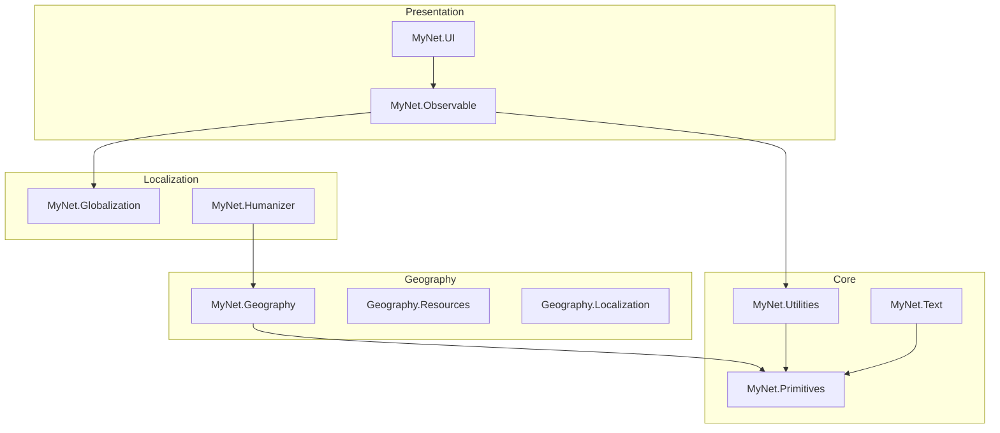

# Getting started with MyNet

This guide helps you choose packages and wire up common scenarios. Each package also has its own README under `src/<Package>/README.md`.

## Prerequisites

- [.NET 10 SDK](https://dotnet.microsoft.com/download)
- A UI host (WPF, Avalonia, MAUI, etc.) when using **MyNet.UI** — the library is UI-framework agnostic; you provide concrete dialog/toast/theme implementations.

## Typical package sets

### Desktop MVVM application

```bash
dotnet add package MyNet.Observable
dotnet add package MyNet.UI
dotnet add package MyNet.Globalization
dotnet add package MyNet.IO
```

Register services in your host (examples vary by UI stack):

```csharp
using Microsoft.Extensions.DependencyInjection;
using MyNet.Globalization.Extensions;
using MyNet.UI.Dialogs;
using MyNet.UI.Locators;
using MyNet.UI.Navigation;
using MyNet.UI.Notifications;
using MyNet.UI.Toasting;
using MyNet.UI.ViewModels;

var services = new ServiceCollection();
services.AddGlobalization();
services.AddViewLocators();
services.AddDialogs(b => b.AddPresenter<MyDialogPresenter>()); // your IDialogPresenter
services.AddNavigation();
services.AddNotifications();
services.AddToasting();
services.AddShell();
// Register ShellHostViewModel + views in your host project
```

See [UI](guides/ui.md), [Dialogs](guides/dialogs.md), [Notifications & toasts](guides/notifications-and-toasts.md), [Shell](guides/shell.md), and [Observable](guides/observable.md).

### Geography + flags + localized names

```bash
dotnet add package MyNet.Geography
dotnet add package MyNet.Geography.Resources
dotnet add package MyNet.Geography.Localization
```

```csharp
using Microsoft.Extensions.DependencyInjection;
using MyNet.Geography.Resources.Extensions;

var services = new ServiceCollection();
services.AddGeographyFlags();
```

See [Geography](guides/geography.md).

### SMTP email (MailKit)

```bash
dotnet add package MyNet.Mail
dotnet add package MyNet.Mail.MailKit
```

See [Mail](guides/mail.md).

### Tests & fake data

```bash
dotnet add package MyNet.Fakers
dotnet add package MyNet.Generator
```

See [Fakers](guides/fakers.md).

## Dependency layering



Prefer referencing **the smallest package** that exposes the API you need. Higher layers pull transitive MyNet dependencies automatically when you pack/consume from NuGet.

## Building packages locally

```bash
dotnet pack MyNet.slnx -c Release
```

Packages are written to the `packages/` folder (see `build/package.props`). Icons and readmes: add PNGs under `assets/` and ensure each packable project has a `README.md`.

## Next steps

| Goal | Read |
|------|------|
| Package list & links | [Documentation index](index.md) |
| Observable / validation / MVVM models | [guides/observable.md](guides/observable.md) |
| Shell, dialogs, navigation | [guides/ui.md](guides/ui.md) |
| Cultures & translations | [guides/globalization.md](guides/globalization.md) |
