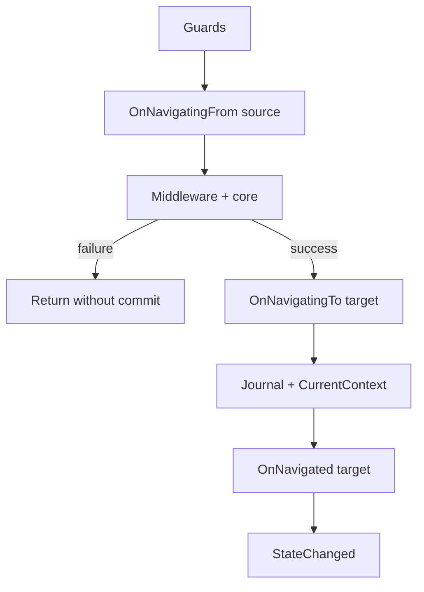

# Navigation

**Package:** [MyNet.UI](../../src/MyNet.UI/README.md)

Application navigation stack **independent of the UI framework** (WPF, Avalonia, etc.): back/forward journal, guards, middleware, lifecycle hooks, and typed parameters.

The library owns **navigation state and orchestration**. Your host project owns **showing views** (via middleware + locators), similar to how dialogs require an `IDialogPresenter`.

Code: [`src/MyNet.UI/Navigation`](../../src/MyNet.UI/Navigation).

## Registration

```csharp
using Microsoft.Extensions.DependencyInjection;
using MyNet.UI.Locators;
using MyNet.UI.Navigation;

var services = new ServiceCollection();

services
    .AddViewLocators()
    .AddNavigation()
    .AddNavigationGuard<UnsavedChangesGuard>()
    .AddNavigationMiddleware<ViewHostNavigationMiddleware>();

// Pages resolved by INavigationClient via ActivatorUtilities
services.AddTransient<DashboardPage>();
services.AddTransient<SettingsPage>();
```

| Extension | Role |
|-----------|------|
| `AddNavigation()` | Journal, lifecycle, `INavigationService`, `INavigationClient` |
| `AddNavigationGuard<T>()` | Authorization / validation rule (order = registration order) |
| `AddNavigationMiddleware<T>()` | Pipeline wrapper (first registered = outermost) |

Pages (`INavigationPage`) are resolved via `ActivatorUtilities` in `INavigationClient` — register them as **Transient** (or Scoped) for the desired lifetime.

**Typical order:** `AddViewLocators()` before navigation middleware that resolves views. See [Locators](ui.md#locators-view--viewmodel) for view ↔ view model mapping.

## Architecture

```text
Application code (ViewModels, commands)
    → INavigationClient
        → INavigationService
            → Guards → Lifecycle (source) → Middleware pipeline → Lifecycle (target) → Journal
```



| Type | Role |
|------|------|
| `INavigationClient` | Fluent API: `To<TPage>().With(...).GoAsync()` |
| `INavigationService` | Low-level navigation, journal, `StateChanged` |
| `INavigationJournal` | Back / forward stacks |
| `INavigationLifecycle` | Delegates hooks to source / target pages |
| `INavigationGuard` | Blocks navigation (`false` → `Cancelled`) |
| `INavigationMiddleware` | Pipeline around the core (UI host, logging, etc.) |
| `INavigationPage` | Page contract (`INavigationLifecycle`) |

The built-in **core** step is a no-op success stub. UI work belongs in **middleware** registered by the host.

## Pages

A page is any type implementing `INavigationPage` (which extends `INavigationLifecycle`). In practice, the page **is often the view model** for the target screen:

```csharp
using MyNet.UI.Navigation.Models;

public sealed class SettingsPage : ObservableObject, INavigationPage
{
    public string SelectedTab { get; private set; } = "General";

    public Task OnNavigatingToAsync(NavigationContext context, CancellationToken cancellationToken)
    {
        SelectedTab = context.Parameters?.Get<string>("Tab") ?? "General";
        return Task.CompletedTask;
    }

    public Task OnNavigatedAsync(NavigationContext context, CancellationToken cancellationToken)
        => Task.CompletedTask;

    public Task OnNavigatingFromAsync(NavigationContext context, CancellationToken cancellationToken)
        => Task.CompletedTask;
}
```

Register the page in DI and map its type to a view via locators (convention or manual `Register`):

```csharp
services.AddViewLocators(r => r.Register(typeof(SettingsPage), typeof(SettingsView)));
services.AddTransient<SettingsPage>();
```

Alternative: keep a thin `INavigationPage` wrapper that holds or creates a view model if you prefer separating navigation lifecycle from presentation state.

## Fluent API

Inject `INavigationClient` in shell or feature view models:

```csharp
public class ShellViewModel(INavigationClient navigation)
{
    public Task OpenSettingsAsync() =>
        navigation
            .To<SettingsPage>()
            .With(new { Tab = "General" })
            .GoAsync();

    public Task OpenPlayerAsync(int id) =>
        navigation
            .To<PlayerPage>()
            .WithParameter(nameof(id), id)
            .GoAsync();

    public Task GoBackAsync() => navigation.GoBackAsync();
}
```

Shortcut:

```csharp
await navigation.NavigateToAsync<PlayerPage>(new { id });
```

Check the result when you need to react to cancellation or errors:

```csharp
var result = await navigation.To<SettingsPage>().GoAsync();
if (result.Status == NavigationStatus.Cancelled)
    return;
```

## Parameters

`NavigationParameters` accepts anonymous objects, dictionaries, records, and `INavigationParameters`:

```csharp
parameters.Get<int>("PlayerId");
parameters.TryGetValue("Count", out long count);
```

Conversion supports `IConvertible`, enums, and nullable types (`long` → `int`, etc.).

## Lifecycle and pipeline rules

| Step | When | Notes |
|------|------|-------|
| Guards | Before anything else | First `false` cancels; journal unchanged |
| `OnNavigatingFrom` | Source page | Runs before middleware; no automatic rollback on middleware failure |
| Middleware | Wraps core | Return non-success to abort without commit |
| `OnNavigatingTo` | Target page | **Only** after successful middleware/core |
| Journal update | After target hooks | Back/forward stacks updated atomically |
| `OnNavigated` | Target page | Navigation committed |
| `StateChanged` | After commit | `CanGoBack`, `CanGoForward`, `CurrentContext` |

## Guards

Guards run in registration order. The first guard returning `false` cancels navigation:

```csharp
public sealed class UnsavedChangesGuard(IDialogService dialogs) : INavigationGuard
{
    public async Task<bool> CanNavigateAsync(
        NavigationContext? from,
        NavigationContext to,
        CancellationToken cancellationToken)
    {
        if (from?.To is IHasUnsavedChanges { IsDirty: true })
            return await ConfirmDiscardAsync(dialogs, cancellationToken);

        return true;
    }
}
```

Use guards for authorization, dirty-state checks, or blocking back navigation — not for UI display.

## Middleware

Middleware follows ASP.NET Core ordering: **first registered = outermost**. Each middleware calls `next()` to continue, or returns a `NavigationResult` to stop the pipeline:

```csharp
public sealed class LoggingNavigationMiddleware(ILogger<LoggingNavigationMiddleware> logger)
    : INavigationMiddleware
{
    public async Task<NavigationResult> InvokeAsync(
        NavigationContext? from,
        NavigationContext to,
        Func<Task<NavigationResult>> next,
        CancellationToken cancellationToken)
    {
        logger.LogInformation("Navigating {From} → {To}", from?.To?.GetType().Name, to.To.GetType().Name);
        return await next().ConfigureAwait(false);
    }
}
```

If middleware returns `Cancelled` or `Failed`, `OnNavigatingTo` / `OnNavigated` are **not** called and the journal is **not** updated.

## Client implementation (WPF / Avalonia / …)

The library does not reference any UI framework. To connect navigation to your shell content region, implement two pieces in the **host project**:

1. **`IViewHost`** — assigns the current view to your shell (e.g. `ContentControl.Content`, Avalonia `ContentControl`, region adapter).
2. **`ViewHostNavigationMiddleware`** — resolves the view for `to.To` and calls the host before `next()`.

### 1. View host abstraction

```csharp
public interface IViewHost
{
    /// <summary>Displays the view for the given page instance.</summary>
    void Show(INavigationPage page, object view);

    /// <summary>Clears the content region (optional, e.g. on ResetAsync).</summary>
    void Clear();
}
```

WPF example (code-behind or behavior bound to a named `ContentControl`):

```csharp
public sealed class WpfViewHost(ContentControl contentHost) : IViewHost
{
    public void Show(INavigationPage page, object view)
    {
        if (view is FrameworkElement element)
            element.DataContext = page;

        contentHost.Content = view;
    }

    public void Clear() => contentHost.Content = null;
}
```

Register as singleton so middleware and shell share the same host:

```csharp
services.AddSingleton<IViewHost, WpfViewHost>();
```

### 2. View host middleware

Resolve the view with `IViewFactory`. When the page **is** the view model, pass `page.GetType()`:

```csharp
using MyNet.UI.Locators.Factories;
using MyNet.UI.Navigation.Models;

public sealed class ViewHostNavigationMiddleware(IViewHost viewHost, IViewFactory viewFactory)
    : INavigationMiddleware
{
    public async Task<NavigationResult> InvokeAsync(
        NavigationContext? from,
        NavigationContext to,
        Func<Task<NavigationResult>> next,
        CancellationToken cancellationToken)
    {
        object view;
        try
        {
            view = viewFactory.CreateView(to.To.GetType());
        }
        catch (ViewResolutionException ex)
        {
            return new NavigationResult(NavigationStatus.Failed, ex.Message, ex);
        }

        viewHost.Show(to.To, view);
        return await next().ConfigureAwait(false);
    }
}
```

Register after `AddViewLocators()`:

```csharp
services
    .AddViewLocators()
    .AddNavigation()
    .AddNavigationMiddleware<ViewHostNavigationMiddleware>();
```

### 3. Shell integration

Wire back/forward commands to `INavigationClient` and refresh `CanExecute` from `StateChanged`:

```csharp
public sealed class ShellChromeViewModel : ObservableObject
{
    private readonly INavigationClient _navigation;

    public ShellChromeViewModel(INavigationClient navigation)
    {
        _navigation = navigation;
        _navigation.StateChanged += OnNavigationStateChanged;
        BackCommand = new RelayCommand(() => _ = _navigation.GoBackAsync(), () => _navigation.CanGoBack);
        ForwardCommand = new RelayCommand(() => _ = _navigation.GoForwardAsync(), () => _navigation.CanGoForward);
    }

    public ICommand BackCommand { get; }
    public ICommand ForwardCommand { get; }

    private void OnNavigationStateChanged(object? sender, NavigationStateChangedEventArgs e)
    {
        (BackCommand as RelayCommand)?.NotifyCanExecuteChanged();
        (ForwardCommand as RelayCommand)?.NotifyCanExecuteChanged();
    }
}
```

Startup navigation (e.g. after splash):

```csharp
await navigationClient.NavigateToAsync<DashboardPage>();
```

### 4. End-to-end host checklist

| Step | Action |
|------|--------|
| Locators | `AddViewLocators()` + map each page type to its view |
| Pages | `AddTransient<TPage>()` for every navigable page |
| Navigation | `AddNavigation()` + guards/middleware |
| View host | Register `IViewHost` singleton bound to shell content region |
| Middleware | `ViewHostNavigationMiddleware` resolves view and calls `IViewHost.Show` |
| Shell VM | Inject `INavigationClient`; subscribe to `StateChanged` for chrome |
| Optional | `UnsavedChangesGuard` + [Dialogs](dialogs.md) for confirm prompts |

There is no built-in `IViewHost` in MyNet.UI today — same pattern as `IDialogPresenter`: the host implements the platform-specific bridge.

## Back / forward

| Operation | Page instance | Journal |
|-----------|---------------|---------|
| `NavigateToAsync` / `To<T>().GoAsync()` | **New** DI instance each time | Pushes previous context on back stack; clears forward |
| `GoBackAsync` / `GoForwardAsync` | **Reuses** instances from journal | Pops/pushes stacks |
| `ResetAsync()` | Clears `CurrentContext` | Clears both stacks; raises `StateChanged` |

Back/forward re-show the same page instance; middleware runs again and should call `IViewHost.Show` with the existing page (view can be recreated or cached in the host).

## Reacting to state

```csharp
navigation.StateChanged += (_, e) =>
{
    // e.CurrentContext, e.CanGoBack, e.CanGoForward
};
```

Useful for title bars, breadcrumb UI, and command `CanExecute` without referencing WPF types from the navigation layer.

## Testing

Navigation works **headless** without a view host — middleware is optional:

```csharp
var services = new ServiceCollection();
services.AddNavigation();
services.AddTransient<TrackingPage>();
await using var provider = services.BuildServiceProvider();

var navigation = provider.GetRequiredService<INavigationClient>();
var result = await navigation.NavigateToAsync<TrackingPage>(new { Id = 1 });

result.Status.Should().Be(NavigationStatus.Succeeded);
```

For UI integration tests, register a stub `IViewHost` that records `Show` calls instead of touching real controls.

See `tests/MyNet.UI.Tests/Navigation/`.

## Source files

| File / folder | Content |
|---------------|---------|
| `NavigationService.cs` | Orchestration, lock, pipeline |
| `NavigationClient.cs` | Facade + DI resolution |
| `NavigationRequestBuilder.cs` | Fluent `To().With().GoAsync()` |
| `Models/` | `NavigationContext`, `NavigationParameters`, statuses |
| `Extensions/ServiceCollectionExtensions.cs` | DI registration |

## Related

- [UI presentation layer](ui.md) — locators overview
- [Shell](shell.md) — host view model, drawers, chrome
- [Dialogs](dialogs.md) — confirm prompts in guards
- [Observable models](observable.md) — page view models
