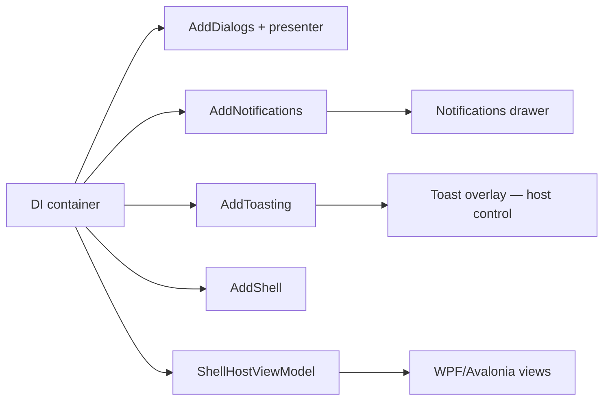

# Shell

**Package:** [MyNet.UI](../../src/MyNet.UI/README.md)

Application **shell**: host view model, drawers (notifications, file menu), taskbar progress, splash/about, and preferences workspace. UI-framework agnostic — your app provides `ShellHostViewModel` and views.

## Registration

```csharp
using Microsoft.Extensions.DependencyInjection;
using MyNet.UI.Dialogs;
using MyNet.UI.Notifications;
using MyNet.UI.Toasting;
using MyNet.UI.ViewModels;

services.AddDialogs(/* optional presenter */);
services.AddNotifications();
services.AddToasting();
services.AddShell();
services.AddShellPreferences(); // display + time/language preference pages

// Host application — register shell VM with your root content
services.AddSingleton<ShellHostViewModel>();
services.AddTransient<PreferencesViewModel>();
```

**Order:** `AddDialogs()` before `AddShell()` (drawer coordinator uses `IContentDialogService`).

## Core services

| Service | Role |
|---------|------|
| `IShellHostProvider` | Attach/detach `IShellHost`; exposes `Current` |
| `IShellService` | Facade: drawers + file menu |
| `IShellDrawerService` | Open/close notification and file menu drawers |
| `IShellFileMenuService` | File menu content and navigation |
| `IApplicationInfo` | App name, version for about/splash |
| `IBusyService` | Global busy state |
| `ITaskbarProgressSource` | Taskbar progress (via `BusyTaskbarCoordinator`) |

Panel view models registered by `AddShell()`:

- `ShellNotificationsViewModel` — notification drawer
- `ShellCultureViewModel` / `ShellThemeViewModel` — chrome
- `SplashScreenViewModel`, `AboutViewModel`

`AddShellPreferences()` registers `DisplayPreferencesViewModel`, `TimeAndLanguagePreferencesViewModel`.

**Theming:** `ShellThemeViewModel` and `DisplayPreferencesViewModel` require host-registered `IThemeService` and `IThemeBaseRegistry`. See [Theming](theming.md).

## Attaching the host

```csharp
public class App(IShellHostProvider shellHost, ShellHostViewModel hostViewModel)
{
    public void OnStartup()
    {
        shellHost.Attach(hostViewModel);
        // hostViewModel is now IShellHost — shell service becomes available
    }
}
```

Until a host is attached, `IShellService.IsAvailable` is false.

## Drawers

```csharp
public class ShellCoordinator(IShellDrawerService drawers)
{
    public void ToggleNotifications() =>
        drawers.SetNotificationsDrawer(isOpen: true);

    public void ShowFileMenu() =>
        drawers.SetFileMenuDrawer(isOpen: true);
}
```

`ShellDrawerCoordinator` coordinates content dialogs with drawer state (registered automatically).

## File menu

Register `FileMenuViewModel` (or use `IFileMenuViewModelFactory`) in the host. `IShellFileMenuService` exposes menu structure and navigation for the shell file menu drawer.

## Taskbar progress

`BusyTaskbarCoordinator` links `IBusyService` to `ITaskbarProgressSource` for long operations. Bind busy UI in the host to `IBusyService`.

## Preferences workspace

```csharp
// Host builds PreferencesViewModel with a list of IPreferencesPage instances
var preferences = new PreferencesViewModel(new IPreferencesPage[]
{
    sp.GetRequiredService<DisplayPreferencesViewModel>(),
    sp.GetRequiredService<TimeAndLanguagePreferencesViewModel>(),
});
```

Open via navigation or shell command in your host app.

## Typical desktop startup



## Testing

`ShellService` + `ShellHostProvider` are tested without UI:

```csharp
var service = new ShellService(new ShellHostProvider());
service.IsAvailable.Should().BeFalse();
```

See `tests/MyNet.UI.Tests/ViewModels/Shell/`.

## Related

- [UI overview](ui.md)
- [Navigation](navigation.md)
- [Dialogs](dialogs.md)
- [Notifications & toasts](notifications-and-toasts.md) — toast overlay control in host UI
- [Locators](ui.md#locators-view--viewmodel) (in ui.md)
