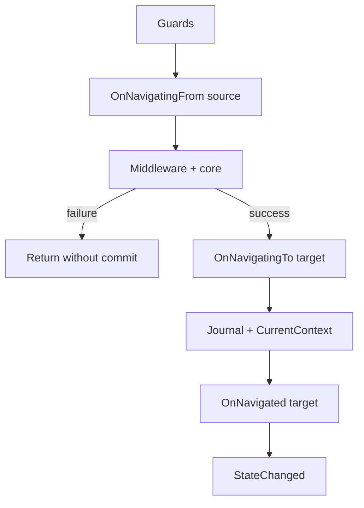

# UI presentation layer

**Package:** [MyNet.UI](../../src/MyNet.UI/README.md)

UI-framework-agnostic **view models**, **shell**, **dialogs**, **navigation**, **notifications**, and **toasts**. You host concrete presenters in WPF, Avalonia, or another stack.

Code lives under [`src/MyNet.UI`](../../src/MyNet.UI).

## Architecture overview

```
┌─────────────────────────────────────────┐
│  Your UI framework (WPF / Avalonia)     │
│  Dialog presenter, Toast presenter,     │
│  Theme resources, Views                 │
└─────────────────┬───────────────────────┘
                  │ implements abstractions
┌─────────────────▼───────────────────────┐
│  MyNet.UI                               │
│  Shell, Navigation, Locators, Dialogs,  │
│  Notifications, Toasts                  │
└─────────────────┬───────────────────────┘
                  │
┌─────────────────▼───────────────────────┐
│  MyNet.Observable, MyNet.Globalization  │
└─────────────────────────────────────────┘
```

### Shared modules

| Module | Folder | Role |
|--------|--------|------|
| Locators | [`Locators`](../../src/MyNet.UI/Locators) | ViewModel ↔ View resolution and MVVM instantiation |
| Navigation | [`Navigation`](../../src/MyNet.UI/Navigation) | App navigation (journal, guards, middleware) without WPF/Avalonia |
| Shell | ViewModels / Shell | Host, drawers, file menu |
| Dialogs | Dialogs | Content dialogs (host provides presenter) |
| Notifications / Toasts | Notifications, Toasting | Bind UI to manager collections |

### Dedicated guides

| Topic | Guide |
|-------|-------|
| Content dialogs, message boxes, file dialogs | [Dialogs](dialogs.md) |
| Notification center & toasts | [Notifications & toasts](notifications-and-toasts.md) |
| Shell, drawers, taskbar, preferences | [Shell](shell.md) |
| Theming (`IThemeService`, light/dark, colors) | [Theming](theming.md) |

---

## DI registration (typical)

```csharp
using Microsoft.Extensions.DependencyInjection;
using MyNet.UI.Dialogs;
using MyNet.UI.Locators;
using MyNet.UI.Navigation;
using MyNet.UI.Notifications;
using MyNet.UI.Toasting;
using MyNet.UI.ViewModels;

var services = new ServiceCollection();

services.AddViewLocators(r => r.Register(typeof(MainViewModel), typeof(MainView)));
services.AddDialogs(b => b.AddPresenter<MyDialogPresenter>()); // IDialogPresenter
services.AddNavigation().AddNavigationGuard<UnsavedChangesGuard>();
services.AddNotifications();
services.AddToasting();
services.AddShell();
services.AddShellPreferences();

// Host registers: ShellHostViewModel, views, theme services
```

See [Dialogs](dialogs.md), [Notifications & toasts](notifications-and-toasts.md), [Shell](shell.md), and [Theming](theming.md) for host responsibilities (`IDialogPresenter`, notification/toast collections, `IThemeService` + resource apply).

---

## Locators (View / ViewModel)

Resolves ViewModel ↔ View pairs and instantiates them in an MVVM architecture.

### DI registration

```csharp
services.AddViewLocators(configureResolver: resolver =>
{
    // Manual mappings (take priority over conventions)
    resolver.Register(typeof(SettingsViewModel), typeof(SettingsView));
});
```

Additional conventions (opt-in; register before or after `AddViewLocators` depending on desired priority):

```csharp
services
    .AddNamespaceConvention()           // ViewModels/Views segments, *View suffix only
    .AddParentNamespaceConvention()     // {Parent}.Views / {Parent}.ViewModels
    .AddAssemblyRootConvention("UI.Views") // {Assembly}.UI.Views.{Name}View
    .AddViewLocators();
```

By default, `AddViewLocators()` registers `SuffixConvention`, `ITypeResolver`, `IViewLocator`, `IViewModelLocator`, and `IViewFactory`.

### Components

| Service | Role |
|---------|------|
| `ITypeResolver` | Resolves the **view type** from a ViewModel (conventions + `Register`) |
| `IViewLocator` | Instantiates a **view**: DI first, otherwise `Activator` (parameterless constructor) |
| `IViewModelLocator` | Instantiates a **view model**: **strict DI** (must be registered) |
| `IViewFactory` | ViewModel → view instance (`Resolve` + `Get`) |

### Convention order

`TypeResolver` walks conventions in **DI registration order** and stops at the first match.

By default, only `SuffixConvention` is registered (swap `ViewModels`/`Views` + try suffixes: `View`, `Control`, `Page`, etc.).

Manual mappings via `resolver.Register(source, target)` **always override** conventions.

### Instantiation policy

- **Views**: register in DI for dependency injection; otherwise reflection instantiation.
- **ViewModels**: always registered in DI (`AddTransient`, `AddScoped`, etc.).

### Creating a view from a ViewModel

```csharp
public class MyShell(IViewFactory viewFactory)
{
    public void Show<TViewModel>()
        where TViewModel : class
    {
        var view = viewFactory.CreateView(typeof(TViewModel));
        // or: viewFactory.CreateView<TViewModel, MyView>();
    }
}
```

On failure (no mapping, incompatible type, instantiation error), `ViewResolutionException` is thrown.

### Supported project layouts

| Convention | ViewModel | View |
|------------|-----------|------|
| `SuffixConvention` (default) | `MyApp.ViewModels.PersonViewModel` | `MyApp.Views.PersonView` (or `PersonPage`, etc.) |
| `NamespaceConvention` | same | `MyApp.Views.PersonView` only |
| `ParentNamespaceConvention` | `MyApp.Features.ViewModels.XViewModel` | `MyApp.Features.Views.XView` |
| `AssemblyRootConvention` | `Any.Namespace.FooViewModel` | `{Assembly}.UI.Views.FooView` |

### Locator source files

- `Conventions/` — naming strategies (`TypeNamingConventionBase`, helpers)
- `Factories/ViewFactory.cs` — orchestration
- `ViewLocator.cs`, `ViewModelLocator.cs` — instantiation
- `ServiceCollectionExtensions.cs` — DI registration

See also [`src/MyNet.UI/Locators/README.md`](../../src/MyNet.UI/Locators/README.md) if present.

---

## Navigation

Application navigation stack **independent of the UI framework** (WPF, Avalonia, etc.): back/forward journal, guards, middleware, lifecycle, and typed parameters.

Code: [`src/MyNet.UI/Navigation`](../../src/MyNet.UI/Navigation).

### DI registration

```csharp
services
    .AddNavigation()
    .AddNavigationGuard<UnsavedChangesGuard>()
    .AddNavigationMiddleware<LoggingNavigationMiddleware>();

services.AddTransient<SettingsPage>();
services.AddTransient<DashboardPage>();
```

| Extension | Role |
|-----------|------|
| `AddNavigation()` | Journal, lifecycle, `INavigationService`, `INavigationClient` |
| `AddNavigationGuard<T>()` | Authorization rule (order = registration order) |
| `AddNavigationMiddleware<T>()` | Pipeline wrapper (first registered = outermost) |

Pages (`INavigationPage`) are resolved via `ActivatorUtilities` in `INavigationClient` — register them as **Transient** (or Scoped) for the desired lifetime.

### Components

| Service | Role |
|---------|------|
| `INavigationClient` | Fluent API: `To<TPage>().With(...).GoAsync()` |
| `INavigationService` | Low-level navigation, journal, `StateChanged` |
| `INavigationJournal` | Back / forward stacks |
| `INavigationLifecycle` | Delegates hooks to source / target pages |
| `INavigationGuard` | Blocks navigation (`false` → `Cancelled`) |
| `INavigationMiddleware` | Pipeline around the core (UI, logging, etc.) |

### Pipeline (execution order)



- **Guards**: first `false` cancels; journal is not modified.
- **OnNavigatingTo**: only after successful middleware/core (target is not prepared on failure).
- **OnNavigatingFrom**: may run before middleware failure; no automatic rollback on the source for now.
- **Core** (`ExecuteCoreAsync`): stub in the library; the UI host (dedicated middleware) will show the view later.

### Fluent API

```csharp
public class ShellViewModel(INavigationClient navigation)
{
    public Task OpenSettingsAsync() =>
        navigation
            .To<SettingsPage>()
            .With(new { Tab = "General" })
            .GoAsync();

    public Task OpenPlayerAsync(int id) =>
        navigation
            .To<PlayerPage>()
            .WithParameter(nameof(id), id)
            .GoAsync();
}
```

Shortcut: `navigation.NavigateToAsync<PlayerPage>(new { id })`.

### Page lifecycle

```csharp
public sealed class SettingsPage : INavigationPage
{
    public Task OnNavigatingToAsync(NavigationContext context, CancellationToken cancellationToken)
    {
        var tab = context.Parameters?.Get<string>("Tab") ?? "General";
        return Task.CompletedTask;
    }

    public Task OnNavigatedAsync(NavigationContext context, CancellationToken cancellationToken)
        => Task.CompletedTask;

    public Task OnNavigatingFromAsync(NavigationContext context, CancellationToken cancellationToken)
        => Task.CompletedTask;
}
```

### Parameters

`NavigationParameters` accepts anonymous objects, dictionaries, records, etc.:

```csharp
parameters.Get<int>("PlayerId");
parameters.TryGetValue("Count", out long count);
```

Optional conversion via `IConvertible`, enums, and nullable types (`long` → `int`, etc.).

### Reacting to state (without WPF)

```csharp
navigation.StateChanged += (_, e) =>
{
    // e.CurrentContext, e.CanGoBack, e.CanGoForward
};
```

Useful for `CanExecute` on Back/Forward in a ViewModel.

### Guard example

```csharp
public sealed class UnsavedChangesGuard : INavigationGuard
{
    public Task<bool> CanNavigateAsync(
        NavigationContext? from,
        NavigationContext to,
        CancellationToken cancellationToken)
    {
        if (from?.To is IHasUnsavedChanges page && page.IsDirty)
            return ConfirmDiscardAsync(cancellationToken);

        return Task.FromResult(true);
    }
}
```

### UI middleware (future WPF / Avalonia client)

The core does not touch controls. Application middleware can:

1. Resolve the view via `IViewFactory` (see [Locators](#locators-view--viewmodel)).
2. Assign shell `Content` / `CurrentView`.
3. Call `next()` so the pipeline completes.

```csharp
public sealed class ViewHostMiddleware(IViewHost host) : INavigationMiddleware
{
    public async Task<NavigationResult> InvokeAsync(
        NavigationContext? from,
        NavigationContext to,
        Func<Task<NavigationResult>> next,
        CancellationToken cancellationToken)
    {
        // host.Show(to.To) — implement in the client project
        return await next().ConfigureAwait(false);
    }
}
```

### Back / forward

- `GoBackAsync` / `GoForwardAsync`: reuse **page instances** stored in the journal.
- `NavigateToAsync` to a new page: new DI instance on each `To<T>()`.
- `ResetAsync()`: clears the journal and raises `StateChanged` (under the same lock as navigations).

### Navigation source files

| File / folder | Content |
|---------------|---------|
| `NavigationService.cs` | Orchestration, lock, pipeline |
| `NavigationClient.cs` | Facade + DI resolution |
| `Models/` | `NavigationContext`, `NavigationParameters`, statuses |
| `ServiceCollectionExtensions.cs` | DI registration |

---

## Related packages

- [Observable models](observable.md)
- [Globalization](globalization.md)
- [IO & platform](io-platform.md)
- [Dialogs](dialogs.md) · [Notifications & toasts](notifications-and-toasts.md) · [Shell](shell.md)

## Package README

[MyNet.UI README](../../src/MyNet.UI/README.md)
